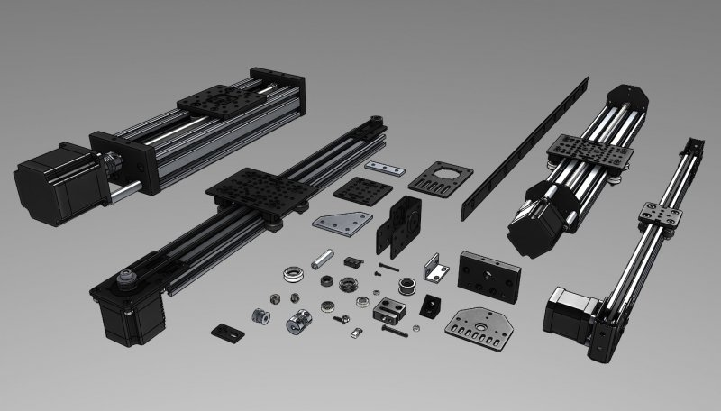

# OpenBuilds Parts for your projects!

Official OpenBuilds Part Models commissioned by OpenBuilds,LLC

The goal when creating these libraries was to produce simple and accurate models. Samples of all parts were measured directly. PDF drawings of the machined parts are provided for reference.

## Disclaimer

By downloading any information or materials from this website you agree and acknowledge that all information or materials are provided as is without any guarantees or warranty of any kind. In association with any downloads or any other information or materials contained on this website, OpenBuilds, LLC makes no warranties of any kind, either express or implied, including but not limited to warranties of merchantability, fitness for a particular purpose, of title, or of noninfringement of third party rights. Use of the download by a user is at the user's risk. OpenBuilds, LLC is not responsible for accuracy or reliability of any content or safety recommendations or lack thereof. Use of any information from this website is at the user's own risk. This website is community driven and by joining you are agreeing to all terms and conditions set forth, therefore you agree that as a user of this site you are solely responsible of all of your own actions.

## Ownership

The 3D models and/or materials made available by OpenBuilds,LLC are protected by copyright and other intellectual property rights which includes all images and digital 3D model information. OpenBuilds,LLC owns all rights, titles and interest and reserves all rights in and to these materials not expressly granted to you in these Terms.

NO REPRESENTATIONS OR WARRANTIES, EITHER EXPRESS OR IMPLIED, OF MERCHANTABILITY, FITNESS FOR A SPECIFIC PURPOSE, THE DOWNLOAD MAY BE USED WITHOUT INFRINGING THE INTELLECTUAL PROPERTY RIGHTS OF OTHERS, OR OF ANY OTHER NATURE ARE MADE WITH RESPECT TO INFORMATION OR THE DOWNLOAD TO WHICH INFORMATION MENTIONS. IN NO CASE SHALL THE INFORMATION BE CONSIDERED A PART OF OUR TERMS AND CONDITIONS OF SALE.
